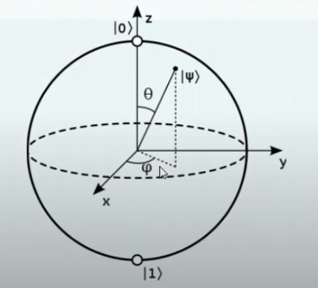
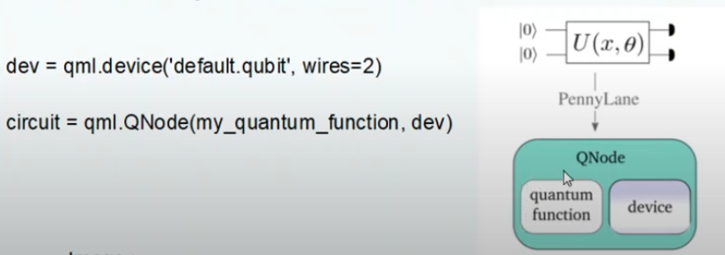
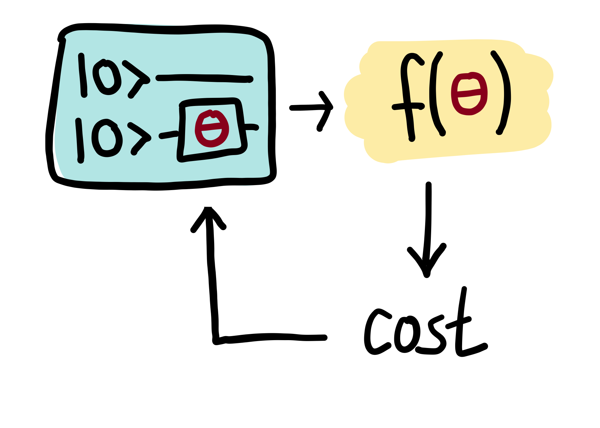
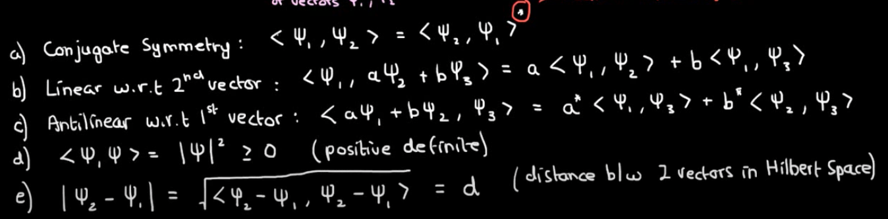

# Quantum Machine Learning

[[QML Internship]]

#### Youtube Tutorial

[Video Link](https://www.youtube.com/watch?v=qCRB0pPkmuc)

##### What is a Qubit?

- A single qubit can be described by a linear combination of state 0 and state one
- Concretely qubit can have $|0> = [1,0]^T \text{ and } |1> = [0,1]^T$
- Their combinations are added together by $\alpha$ and $\beta$, where they are complex numbers
- The qubit, given by $\phi$ , must be a unit vector where length =1

##### Bloch Sphere

- Moving $\theta$ will change the state value
- Moving $\phi$ will change the phase of the quantum state
- Manipulating both will allow us to move it to any point on the sphere

#### PennyLane Documentation

- Designed to be hardware and device agnostic, allowing quantum functions to be easily dispatched to different quantum devices
- We create a Quantum function (circuit + device)
- Classical Gradient decent is possible with PennyLane

##### Quantum Embedding

- AngleEmbedding layer -> process data into qubit rotations
  - It encodes N features into the rotation angles of n qubits

- StronglyEntanglingLayers -> entangle the features together to do processing

- PennyLane provides templates for embedding

##### Variational Circuits

An alternative name is "parameterized quantum circuits"

- Ingredients in a Variational Circuit
  1. Fixed initial state (vacuum state or zero state)
  2. A quantum circuit $U(\theta)$ where the free params are $\theta$ -> the entanglement param is $\theta$
  3. Qubit rotations will be optimized
  4. Measurement at the output
- They are trained by classical optimization algorithms and $\theta$ is updated with every step (assuming using Stochastic Gradient Descent)
- A near term solution for quantum models
- Typically they have short gate sequences, to minimize floating error in each output
- Classical input is fed into the quantum circuit alongside weights ($\theta$) and is converted back to classical information by measuring and evaluating the expectation value of the observable value

##### Quantum Embedding

QE represents classical data as quantum states in a [Hilbert space](https://www.youtube.com/watch?v=7zx3MT9FgT0) via a [quantum feature map](https://pennylane.ai/qml/glossary/quantum_feature_map.html).

##### Hilbert Space Properties

1. It is a linear vector space
2. It has an inner product operation that satisfies certain conditions
3. Conditions for inner product

4. Hilbert spaces are separable, so they contain a dense subset

##### Quantum Gradients

1. The output of a variational circuit is the expectation value of a measurement observable
2. Concretely, it can be perceived as a quantum function $f(\theta)$ with tunable params $\theta = \theta_1 ,  \theta_2..$
3. As with any other function, we can find the partial derivatives $f$ with respect to each $\theta$ and conduct backpropagation
4. Essentially, it becomes a "quantum Jacobian" that is used by the classical optimizer.

##### Quantum Neural Networks

Broadly speaking, this can be thought of as a quantum circuit with trainable params
